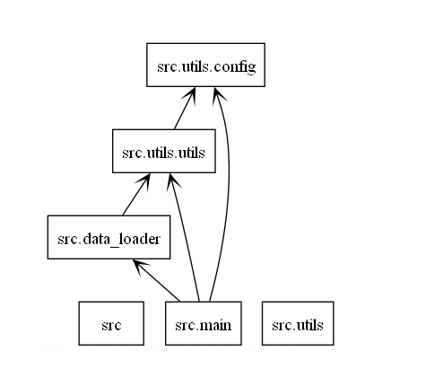
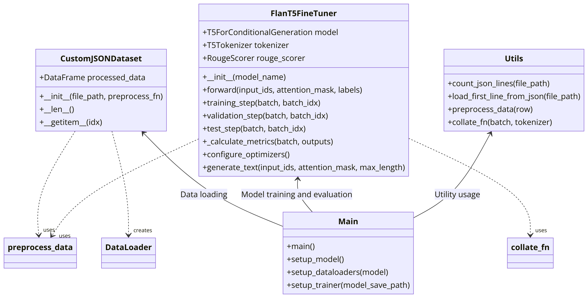
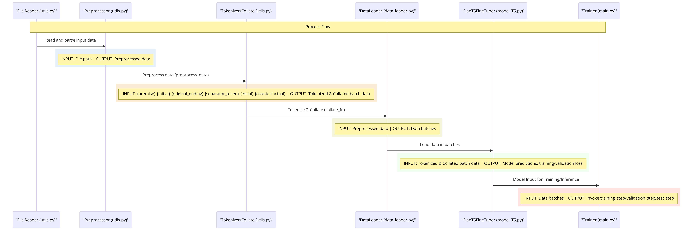

# Evaluation Metrics of Counterfactual Story Rewriting

This repository contains the dataset and code accompanying the paper:

**"Title of Your Paper"**  
*Authors: Author1, Author2, Author3*  

Link to paper: [paper link](#)

## 1. Introduction

Pearl's causal ladder delineates challenges in AI-driven by data into three distinct levels: observation (termed "seeing"), intervention ("doing"), and counterfactuals ("imagining").

**Observation**: This tier focuses on recognizing statistical correlations, posing questions like, "How often do I resort to aspirin for my headaches?" Concentrating on the statistical interrelations among variables, it involves probabilistic analysis of joint and conditional distributions, denoted by P(X = x, Y = y) and P(Y = y|X = x).

**Intervention**: This tier is about executing strategic actions to realize specific goals, such as, "Will taking an aspirin now mitigate my headache?" It employs the do-operator [24] and Causal Bayesian Networks [63] for depicting interventions, for example, illustrating the distribution of Y when X is manipulated to a certain value x, represented as P(Y = y|do(X = x)).

**Counterfactuals**: This tier engages with counterfactual contemplation, pondering over hypothetical scenarios that differ from the actual events, even contradicting them at times, such as, "Had I taken an aspirin, would my headache have ceased?" Counterfactual probabilities are represented as P(Yx = y), signifying the likelihood that "Y would have been y, had X been x." Addressing counterfactual notions necessitates Structural Causal Models (SCMs) [63], which are robust tools as they facilitate precise articulation of concepts across all three rungs [3].

As one progresses through this hierarchy, the complexity of issues escalates, demanding a profound understanding of causality that transcends observable data. This framework introduces unique challenges and opportunities, especially concerning explainability and its intersection with causal studies. We focus on natural language processing, where deciphering inherent causality is crucial. Such understanding is instrumental for identifying and substituting components within models with coded modules, potentially enhancing their reliability and performance.

**Counterfactual story rewriting**

Counterfactual reasoning entails the exploration of alternative scenarios that deviate from the current storyline. This notion is extensively examined in fields such as psychology, as indicated by Epstude and Roese (2008), cognitive science as mentioned by Byrne (2002), and natural language processing, as discussed in the works of Hobbs (2005), Lawrence and Riezler (2018), and Son et al. (2017). Despite advancements in NLP through pre-trained models like BERT (Devlin et al., 2018) and GPT (Radford et al., 2018), these models often struggle to distinguish between plausible and implausible counterfactuals, a challenge accentuated in Zellers et al. (2019). Furthermore, when these models manage to discern reasonable alternatives, they may rely on underlying biases in the dataset, as observed in studies by Niven and Kao (2019) and Zellers et al. (2018), rather than cultivating a robust comprehension of counterfactual reasoning. Encouraging models to generate outcomes from counterfactual prompts might deepen their understanding of the underlying situation dynamics, as opposed to merely distinguishing between two alternatives, which might leverage biases in the dataset (Lianhui et al., 2019). This approach is akin to script learning, which involves normalizing typical event sequences to understand causal narrative structures, as researched by Pichotta and Mooney (2014) and Chambers (2013). However, encapsulating the complexity of causal relationships in templated formats poses challenges, as highlighted by Sap et al. (2019). Consequently, our focus is on counterfactual reasoning within unstructured text, necessitating models to not only comprehend but also generate the outcomes of such reasoning.

In our tasks, the "counterfactual event" resembles a causal intervention in the story's sequence of events, as conceptualized by Pearl (2000). This requires narrative alterations to be congruent with the general understanding of how the world functions, thereby integrating causal reasoning in a format accessible to those not well-versed in formal causality concepts. This framework also enables us to evaluate the strengths and weaknesses of recent developments in neural language models in terms of counterfactual reasoning. Counterfactual rewriting probes into the causes and effects within a story, potentially necessitating intricate and varied modifications to correspond with the counterfactual event.


## 2. Repository Structure

The repository is structured as follows:

```
TIMETRAVEL/
│
├── README.md            # Project overview and instructions
├── LICENSE              # License information
├── .gitignore           # Files and folders to be ignored by git
│
├── src/                 # Source code for the project
│   ├── main.py          # Main script to run the models
│   ├── models/          # Model definitions
│   │   └── model_T5.py  # T5 model for story rewriting
│   ├── utils/           # Utility scripts and functions
│   │   └── utils.py     # Helper functions
│   └── data_loader.py   # Data loading and preprocessing scripts
│
├── data/                # Data directory
│   ├── raw/             # Raw data, unprocessed
│   ├── processed/       # Processed data ready for model input
│   └── external/        # Any external data sources
│
├── notebooks/           # Jupyter notebooks for experiments and analysis
│   └── exploration.ipynb
│
├── requirements.txt     # Project dependencies
│
├── tests/               # Test scripts
│   └── test_model_T5.py # Test for T5 model
│
├── scripts/             # Utility scripts, e.g., setup or installation scripts
│   └── setup.sh
│
├── models/              # Trained model files
│   └── model_T5.pkl
│
└── docs/                # Documentation files
    └── model_T5.md      # Documentation specific to T5 model
```

## 3. Dataset: TimeTravel

The TimeTravel dataset is curated to facilitate the training and evaluation of models on the task of counterfactual story rewriting. It contains stories along with their original and counterfactually altered endings [cite the orginal paper].

- `train_supervised_small.json`: Supervised training set with human-annotated rewritten endings (28,363 examples).
- `train_supervised_large.json`: A larger version of the supervised training set (16,752 examples).
- `dev_data.json`: Development set (1,871 examples).
- `test_data.json`: Test set (1,871 examples).

The dataset can be **downloaded** from [here](https://drive.google.com/file/d/150jP5FEHqJD3TmTO_8VGdgqBftTDKn4w/view?usp=sharing).

### Data Example

```json
{
  "story_id": "4fd7d150-b080-4fb1-a592-8c27fa6e1fc8",
  "premise": "Andrea wanted a picture of her jumping.",
  "initial": "She set the camera up.",
  "counterfactual": "She asked her friend to draw one.",
  "original_ending": "Then, she jumped in the air. The picture kept coming out wrong. It took twenty tries to get it right.",
  "edited_ending": [
    "Then, she jumped in the air to demonstrate how she wanted it to look.",
    "The picture kept coming out wrong.",
    "It took drawing it several times to get it right."
  ]
}
```

## 4. Code 
The  project is a structured Python application, primarily dealing with data processing, model training, and prediction using a pretrained Flan-T5 model. This is a break down the the functionality of each file and dataflow:



### 4.1  `src/utils/utils.py`
This file contains utility functions to handle data preprocessing and loading.

- **`count_json_lines(file_path)`:** Counts lines in a JSON file, used for data validation or insight.
- **`load_first_line_from_json(file_path)`:** Loads the first line from a JSON file, could be used for testing or data inspection.
- **`preprocess_data(row)`:** Processes each row of data, extracting necessary fields and constructing input-output sequences for model training or inference.

  - Input: x1x2yx1xx2 
  ({premise} {initial} {original_ending} {separator_token} {initia}{counterfactual})
  - Output: s'_{3:5} 
  ({edited ending})


      - $p_{\theta}$: The probability distribution parameterized by $(\theta$).
      - $s'_{3:5}$: The sequence representing the edited ending.
      - $S$: The complete story (x1x2y).
      - $[s]$: Separator token.
      - $s1$: The premise (x1).
      - $s'_{2}$: The counterfactual input (xx2).


- **`collate_fn(batch, tokenizer)`:** Prepares batches of data by tokenizing and structuring them in a format that the model expects.

### 4.2. `src/utils/config.py`
Defines the configuration parameters for the project, like paths, model configurations, and training parameters. It ensures that these configurations are centralized and can be easily managed or changed.

### 4.3. `src/data_loader.py`
Handles data loading:

- **`CustomJSONDataset`:** A PyTorch `Dataset` class that reads data from a JSON file and preprocesses it using `preprocess_data` from `utils.py`.
- **`create_dataloaders`:** Creates PyTorch `DataLoader` objects for batching and efficient data loading during model training or inference.

### 4.4. `src/models/model_T5.py`
Defines the model and training procedures:
The core of this project lies in fine-tuning pre-trained language models, such as Flan-T5, for the task of counterfactual story rewriting. The model is trained to minimise the log-likelihood of generating the actual rewritten endings based on the given story context and a counterfactual premise.

The objective during training is to minimise the log-likelihood of the actual rewritten endings:

```math
L_s(\theta) = \log p_{\theta}(s'_{3:5} \mid S, [s], s_1, s'_{2})
```

- **`FlanT5FineTuner`:** A class that wraps around the T5 model for fine-tuning on your specific task. It includes methods for the forward pass, training, validation, and testing steps.
- It also includes methods for generating text (`generate_text`) and calculating custom metrics (`_calculate_metrics`).

### 4.5. `src/main.py`
The main executable script for the project:

- Orchestrates the process by setting up the model, data loaders, and the trainer.
- Initializes the `FlanT5FineTuner` and prepares the data loaders for training, validation, and testing datasets.
- Sets up a PyTorch Lightning `Trainer` to manage the training process, including checkpointing and logging.
- Handles the execution of the training process and optionally testing and validation.



### 5. Data Flow Overview:
  5.1. **Data Reading & Preprocessing:**
    - Data is read from JSON files using the `CustomJSONDataset` class.
    - Data is preprocessed per row using `preprocess_data` which constructs input-output sequences needed by the model.

  5.2. **Data Batching & Tokenization:**
    - `DataLoader` objects are created for batching.
    - Batches of data are tokenized and structured properly by `collate_fn` during the data loading process.

  5.3. **Model Training & Validation:**
    - `FlanT5FineTuner` handles the model training, validation, and testing.
    - It uses the batches prepared by `DataLoader` and performs forward passes, loss calculation, and backpropagation.
    - It also generates text and calculates custom metrics like BLEU and ROUGE scores.

  5.4. **Checkpointing & Logging:**
    - Model checkpoints and logs are managed by PyTorch Lightning's `Trainer`, saving the state of the model and logging metrics for monitoring.

  5.5. **Execution Control:**
    - `main.py` orchestrates the whole process, ensuring that the model, data, and training utilities are correctly set up and executed.



 


## 6. Model Evaluation

The performance of the models is evaluated based on their ability to generate coherent and contextually relevant story endings that are consistent with the counterfactual premise. Both automated metrics (e.g., BLEU, ROUGE) and human evaluations are used to assess the quality of the rewritten stories.


## Citation

If you find our dataset or code useful in your research, please consider citing our paper:

```bibtex
@inproceedings{your_paper,
    title = "Title of Your Paper",
    author ="Authors",
    booktitle = "Conference",
    month = "Month",
    year = "Year",
    address = "Location",
    publisher = "Publisher",
    url = "Paper URL",
}
```

## References

- [1] Pearl, J., & Mackenzie, D. (2019). *The book of why*. Penguin Books.

For any questions or further information, please contact [Author's Email].
