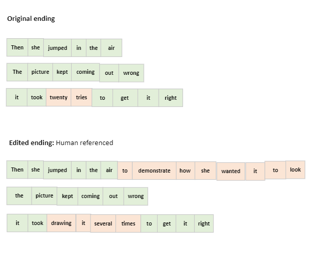

This is an explantion of the different metrics used in Story Rewriting

## Table of Contents
1. [Bleu (BiLingual Evaluation Understudy) ](#Bleu)
2. [Rouge (Recall-Oriented Understudy for Gisting Evaluation)](#Rouge)
3. [Bert](#Bert)
4. [Bart](#Bart)


When it comes to evaluating Natural Language Processing (NLP) models, we often rely on metrics like accuracy or F1 score for tasks that have clear-cut right or wrong answers. However, assessing the quality of generated text, such as rewritten stories, requires a more nuanced approach. This is where the BLEU (BiLingual Evaluation Understudy), ROUGE (Recall-Oriented Understudy for Gisting Evaluation)  metric comes into play.

## Evaluation Metrics for Story Rewriting

| Metric            | Variant           | Pros                                                                                                 | Cons                                                                                                                             | Details |
|-------------------|-------------------|------------------------------------------------------------------------------------------------------|----------------------------------------------------------------------------------------------------------------------------------|---------|
| **BLEU**          |                   |                                                                                                      |                                                                                                                                  |         |
|                   | BLEU-n            | - Measures precision of n-grams.<br>- Useful for ensuring local linguistic accuracy.                 | - Ignores semantic meaning beyond surface n-grams.<br>- Doesn't account for fluency or global narrative structure.                | **Precision (P)**: $\frac{\sum_{\text{n-gram in edited}} \min(\text{count in edited}, \text{count in reference})}{\sum_{\text{n-gram in edited}} \text{count}}$<br>**BLEU score**: $\text{BP} \times \exp(\sum_{n=1}^{N} w_n \log p_n)$<br>where BP is brevity penalty, $p_n$ is precision for n-grams, and $w_n$ is weight for each n-gram. |
|                   | SACREBLEU         | - Standardized BLEU implementation.<br>- Mitigates issues with tokenization and comparability.      | - Doesn't address core limitations of BLEU, like handling of semantics or narrative coherence.                                    | Ensures comparability by standardizing BLEU computation and handling tokenization. |
| **ROUGE**         |                   |                                                                                                      |                                                                                                                                  |         |
|                   | ROUGE-1           | - Measures overlap of unigrams.<br>- Good for assessing content retention.                           | - Ignores word order.<br>- Can't capture complex narrative structures.<br>- Doesn't account for synonyms or paraphrasing.         | **Recall (R)**: $\frac{\sum_{\text{unigram in edited}} \min(\text{count in edited}, \text{count in original})}{\sum_{\text{unigram in original}} \text{count}}$ |
|                   | ROUGE-2           | - Measures bigram overlap.<br>- Better at capturing phrases and local narrative structures.         | - More sensitive to word order changes.<br>- May miss the broader narrative context.                                             | **Recall (R)**: $\frac{\sum_{\text{bigram in edited}} \min(\text{count in edited}, \text{count in original})}{\sum_{\text{bigram in original}} \text{count}}$ |
|                   | ROUGE-L           | - Considers longest common subsequence.<br>- Reflects sentence-level structure and coherence.        | - Might not fully capture the narrative style or complex story transformations.                                                   | **Recall (R)**: $\frac{\text{LCS(edited, original)}}{\text{length(original)}}$<br>**Precision (P)**: $\frac{\text{LCS(edited, original)}}{\text{length(edited)}}$<br>**F1-Score**: $\frac{2 \times P \times R}{P+R}$ |
|                   | SACREROUGE        | - Provides a standardized implementation.<br>- Addresses some tokenization and comparison issues.    | - Still limited by the inherent constraints of the ROUGE metric (surface-level analysis).                                         | Standardizes and refines ROUGE computation. |
| **BERT**          | BERTScore         | - Leverages contextual embeddings.<br>- Captures semantic similarity and paraphrasing.<br>- More robust to diverse linguistic expressions. | - Computationally more intensive.<br>- May require fine-tuning or adaptation for specific narrative styles in story rewriting. | Computes cosine similarity between BERT embeddings of the words in the generated and reference texts, providing a score that captures semantic meanings. |
| **BART**          | BARTScore         | - Can consider both precision and recall aspects.<br>- Effective for text generation tasks like story rewriting.<br>- Accounts for semantic coherence and fluency. | - Computationally intensive.<br>- Performance can depend on the quality of the underlying model.                                  | Utilizes the BART model's capabilities for both generation and evaluation, offering a holistic assessment of text quality based on both content and structure. |

In the remaining section we will use as example a  story that revolves around a character, Andrea, who initially wants a picture of herself jumping. However, a counterfactual change is introduced where she asks her friend to draw it instead. The model then generates an "edited ending" that should reflect this counterfactual scenario.

```json
{
  "story_id": "4fd7d150-b080-4fb1-a592-8c27fa6e1fc8",
  "premise": "Andrea wanted a picture of her jumping.",
  "initial": "She set the camera up.",
  "counterfactual": "She asked her friend to draw one.",
  "original_ending": "Then, she jumped in the air. The picture kept coming out wrong. It took twenty tries to get it right.",
  "edited_ending": [
    "Then, she jumped in the air to demonstrate how she wanted it to look.",
    "The picture kept coming out wrong.",
    "It took drawing it several times to get it right."
  ]
}
```



### Bleu (BiLingual Evaluation Understudy) 
The essence of BLEU is to provide a single numerical score that reflects the quality of the generated text by comparing it to one or more reference texts. For instance, if we have a story ending rewritten by a model, we want to know how closely it resembles the original or a human-authored ending.

BLEU evaluates the quality of text by comparing n-grams of the model-generated ending ("edited_ending") to the n-grams of the reference text ("original ending" ). An n-gram is simply a sequence of 'n' consecutive words. For example, "she jumped" is a bigram (2-gram), while "she jumped in" is a trigram (3-gram).

**Unigram Precision**
One aspect of BLEU is unigram precision, which counts the number of single words from the generated text that appear in the reference text, normalized by the total number of words in the generated text.


For the above story, if the model-generated ending ("edited_ending") has 30 words, with 18 matching unigrams found in the original ending (20 words), then:

- Unigram Precision (P) is calculated as:
  $( P = \frac{\text{Number of matching unigrams}}{\text{Total unigrams in Edited Ending}} = \frac{18}{30} = 0.6 $)
  
- This means 60% of the words in the edited ending are found in the original ending, indicating a certain level of verbatim content retention.

**Modified Precision**
BLEU addresses the issue of repetitive patterns by using a modified precision. It clips the count of each word to the maximum number it appears in the reference. This prevents over-counting and rewards diversity in the generated text.

**Word Ordering**
BLEU considers higher-order n-grams to account for the order of words. For instance, if "jumped in the air" appears in both the original and edited endings, it contributes to a higher BLEU score than just matching individual words like "jumped" or "air".

**BLEU Score Calculation**
BLEU calculates the geometric mean of the precision scores across different n-grams, often up to 4-grams. For our example, the BLEU score would take into account the precision of unigrams, bigrams, trigrams, and 4-grams between the edited and original endings.

**Output and Interpretation**
The BLEU score output includes individual precision scores for each n-gram and an overall BLEU score. A higher BLEU score implies that the generated text is more similar to the reference, suggesting better quality rewriting in our context.


while BLEU can offer insights into the lexical accuracy and word order of rewritten stories, ROUGE complements it by providing a more comprehensive evaluation of recall, narrative coherence, and the inclusion of crucial plot elements.

## Rouge (Recall-Oriented Understudy for Gisting Evaluation)
ROUGE provides a way to quantify how closely a generated text (in this case, an "edited ending") mirrors a Human reference text ("original ending"). ROUGE compares the n-grams (chunks of n consecutive words) of a generated text to the n-grams of reference texts. It helps us understand how much of the content and structure of the reference text is captured in the generated text. We typically compare the "edited ending"(generated text) to the "original ending"(reference text) to evaluate:

- The model's ability to incorporate the counterfactual change effectively.
- How well the model maintains narrative coherence and contextual relevance.

Let's explore how this applies to our example and how ROUGE can be used to assess the quality of a story rewritten by a model like T5.
The metric assesses how well the edited ending reflects the counterfactual change and maintains coherence, fluency, and relevance. It's based on the overlap of n-grams between the generated and reference texts.

1. **ROUGE-1 (Unigram Overlap)**:
    Measures the overlap of individual words between the "edited ending" and the "original ending".
    Example Result: Let's say the ROUGE-1 score is high. This indicates that many individual words from the "original ending" are also present in the "edited ending". 
    In our case, words like "she", "jumped", "the", "air", "picture", "coming", "out", "wrong", "took", "times", "get", "right" are present in both.

    A high ROUGE-1 score suggests that the "edited ending" retains significant content from the "original ending". However, it doesn't necessarily indicate that the counterfactual change has been effectively integrated or that the story's flow and structure are coherent.

- **Hypothetical Result**: 
     - Matches: 18 unigrams
     - Total unigrams in "Edited Ending": 30
     - Total unigrams in "Original Ending": 20
   - **Precision (P)**: $( \frac{\text{Number of matching unigrams}}{\text{Total unigrams in Edited Ending}} = \frac{18}{30} = 0.6 $)
   Meaning: 60% of the words in the Edited Ending are also present in the Original Ending. It implies that 60% of the content of the Edited Ending is directly relevant to the content of the Original Ending.
   - **Recall (R)**: $( \frac{\text{Number of matching unigrams}}{\text{Total unigrams in Original Ending}} = \frac{18}{20} \approx 0.90 $)
   Meaning: 90% of the words in the Original Ending are also found in the Edited Ending. This suggests that the Edited Ending does a good job of preserving the content of the Original Ending.
   - **F1-Score**: $( 2 \times \frac{P \times R}{P + R} = 2 \times \frac{0.6 \times 0.90}{0.6 + 0.90} \approx 0.72 $)
   Meaning: The F1 score of approximately 0.72 suggests a good balance between precision and recall. It indicates that the Edited Ending is quite relevant and complete in comparison to the Original Ending but there is room for improvement in either precision, recall, or both.
   - **Interpretation**: A high ROUGE-1 score suggests significant content overlap. However, it doesn't account for the order or structure of the words. While the recall is high (0.90), indicating most of the original content is captured, the precision is slightly lower (0.6), suggesting some additional content in the edited ending.


2. **ROUGE-2 (Bigram Overlap)**:
    Assesses how pairs of consecutive words (bigrams) from the "original ending" are preserved in the "edited ending".
    Example Result: If the ROUGE-2 score is lower than ROUGE-1, it might indicate that while individual words are present, specific phrases or expressions are less frequently preserved. 
    For instance, bigrams like "jumped in", "coming out", "took drawing", are present but others might not be.
    This metric is used for evaluating whether the model captures the narrative's flow and the sequence of events. A lower ROUGE-2 score may suggest changes in how events or actions are described, reflecting the model's adaptation to the counterfactual scenario.
- **Hypothetical Result**: 
     - Matches: 12 bigrams (An assumption)
     - Total bigrams in "Edited Ending":  29 (30 words - 1)
     - Total bigrams in "Original Ending": 19 (20 words - 1)

    **Precision (P):**
    - Formula: $( P = \frac{\text{Number of matching bigrams}}{\text{Total bigrams in Edited Ending}} $)
    - Calculation: $( P = \frac{12}{29} \approx 0.414 $)
    - Meaning: Precision measures how many of the bigrams from the Edited Ending are actually present in the Original Ending. Here, approximately 41.4% of the bigrams in the Edited Ending are correct as per the Original Ending.

    **Recall (R):**
    - Formula: $( R = \frac{\text{Number of matching bigrams}}{\text{Total bigrams in Original Ending}} $)
    - Calculation: $( R = \frac{12}{19} \approx 0.632 $)
    - Meaning: Recall measures how many of the bigrams from the Original Ending are captured in the Edited Ending. Here, approximately 63.2% of the Original Ending's bigrams are preserved in the Edited Ending.

    **F1 Score:**
    - Formula: $( F1 = 2 \times \frac{P \times R}{P + R} $)
    - Calculation: $( F1 = 2 \times \frac{0.414 \times 0.632}{0.414 + 0.632} \approx 0.5 $)
    - Meaning: The F1 Score balances precision and recall. In this case, the score suggests that the Edited Ending has a fair balance of bigram precision and recall, but there is room for improvement in matching the Original Ending's structure more closely.

    **Interpretation**: A lower ROUGE-2 score compared to ROUGE-1 indicates that while individual words are present, the specific sequences or phrases are less preserved. This could reflect the model's adaptation to the counterfactual scenario, altering the story's flow or sequence of events.


3. **ROUGE-L (Longest Common Subsequence)**:
Focuses on the longest sequence of words that appear in the same relative order (not necessarily contiguous) in both the "edited ending" and the "original ending".
Example Result: If ROUGE-L scores are high, it indicates that there's a significant overlap in the structure of the "edited ending" and the "original ending". 
For instance, the sequence "Then, she jumped in the air... the picture kept coming out wrong... it took... to get it right" is a common subsequence.

A high ROUGE-L score suggests that the model preserves the overall structure and narrative flow from the "original ending" in the "edited ending". This metric is particularly valuable in assessing whether the "edited ending" maintains logical coherence and readability despite the counterfactual change.

- **Hypothetical Result**: 
     - LCS Length: 18 words
     - Total words in "Edited Ending": 20
     - Total words in "Original Ending": 30
    **Precision (P):**
    - Formula: $( P = \frac{\text{Length of LCS}}{\text{Total words in Edited Ending}} $)
    - Calculation: $( P = \frac{18}{30} = 0.6 $)
    - Meaning: Precision here reflects the proportion of the Edited Ending that is part of the LCS with the Original Ending. About 60% of the Edited Ending is part of the LCS.

    **Recall (R):**
    - Formula: $( R = \frac{\text{Length of LCS}}{\text{Total words in Original Ending}} $)
    - Calculation: $( R = \frac{18}{20} = 0.9 $)
    - Meaning: Recall here reflects the proportion of the Original Ending that is part of the LCS with the Edited Ending. About 90% of the Original Ending is part of the LCS.

    **F1 Score:**
    - Formula: $( F1 = 2 \times \frac{P \times R}{P + R} $)
    - Calculation: $( F1 = 2 \times \frac{0.6 \times 0.9}{0.6 + 0.9} \approx 0.72 $)
    - Meaning: The F1 Score for ROUGE-L suggests that the Edited Ending is fairly consistent with the sequence of the Original Ending, maintaining a good degree of narrative structure.

   **Interpretation**: ROUGE-L focuses on the sequence and structure. A relatively high score indicates that the "edited ending" maintains the narrative flow and logical structure of the "original ending". The model seems to capture the essence and coherent structure of the story despite the counterfactual change.

4. ROUGE-LSUM (Summation over Entire story):

This variant of ROUGE-L is similar in calculation but applied over the entire story rather than individual sentences.

**The precision, recall, and F1 score for ROUGE-LSUM would be the same as for ROUGE-L if the entire text is treated as one single summary. If the summary is broken down into sentences, then ROUGE-L would be computed for each sentence and averaged, which could lead to different scores. Since the exact method of computation for ROUGE-LSUM in this context is not specified, we will assume it to be the same as ROUGE-L for the sake of this example.**


By analyzing the detailed ROUGE scores, we obtain a multi-dimensional view of the model's performance:
Balance Between Metrics: Ideally, one wants a balance between these scores. High ROUGE-1 and ROUGE-2 scores indicate good content preservation, while a high ROUGE-L score suggests narrative coherence. However, excessively high scores, especially in ROUGE-1, might indicate that the model isn't effectively adapting the story to the counterfactual scenario but rather regurgitating the "original ending".

Iterative Improvement: Use these metrics to identify strengths and weaknesses in the model. For instance, if ROUGE-2 scores are low, the model might be altering the narrative sequence too much, losing the story's essence. Use these insights to iteratively improve your model's training and fine-tuning process.
- **ROUGE-1** highlights the model's ability to retain key content elements, even introducing new aspects to accommodate the counterfactual change.
- **ROUGE-2** reveals how the model adapts the sequence of events, indicating its narrative flexibility and creativity in aligning with the counterfactual.
- **ROUGE-L and ROUGE-LSUM** underscores the model's competence in maintaining structural coherence and narrative logic, crucial for the story's authenticity and engagement.


## Bert
## Bart


# Conclusion

Metrics need to account not just for linguistic accuracy but also for narrative coherence, contextual relevance, and the ability to capture the nuances introduced by counterfactual changes or story transformations.
- **BLEU and ROUGE Variants**: Provide insights into textual similarity at different granularities, but fundamentally focus on surface-level n-gram overlaps. SACRE variants aim to standardize and improve computation, considering tokenization and linguistic nuances.
- **Semantic Metrics (BERTScore and BARTScore)**: Leverage advanced transformer models to understand semantic and narrative structures, suitable for story rewriting tasks where capturing underlying narrative and semantic changes is crucial.


Reference:
What is rouge metric?
https://www.youtube.com/watch?v=TMshhnrEXlg

What is the Bleu metric
https://www.youtube.com/watch?v=M05L1DhFqcw&t=196s